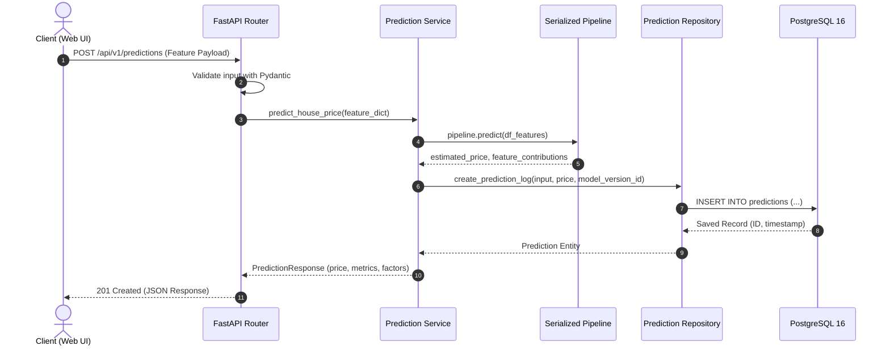

# 02. System Architecture: House Price Intelligence & Prediction Platform

## 1. High-Level Architectural Overview

The system is organized into decoupled layers to enforce separation of concerns, maintainability, and testability.

```mermaid
flowchart TD
    subgraph Client ["Frontend: Next.js 15+"]
        UI[Executive UI / Tailwind CSS]
        Nav[App Router / Navigation]
        Store[React State & Hooks]
        Charts[Recharts Visualization Engine]
    end

    subgraph Gateway ["FastAPI Gateway & API Layer"]
        Router[API Routers /api/v1]
        Middleware[CORS, Logging, Error Handler]
        Validator[Pydantic v2 Schemas]
    end

    subgraph Service ["Business & ML Service Layer"]
        PropertySvc[Property Service]
        AnalyticsSvc[Analytics Engine]
        PredictionSvc[ML Inference Service]
        ModelRegistrySvc[Model Registry Service]
    end

    subgraph MLPipeline ["ML Artifact Subsystem"]
        Artifact[Serialized Pipeline (.joblib)]
        Metadata[Model Metadata (.json)]
    end

    subgraph DataLayer ["Persistence Layer"]
        Repo[SQLAlchemy Repositories]
        Postgres[(PostgreSQL 16 DB)]
    end

    UI -->|HTTP / JSON| Gateway
    Gateway --> Validator
    Validator --> Service
    PredictionSvc -->|Loads pipeline| MLPipeline
    PropertySvc --> Repo
    AnalyticsSvc --> Repo
    PredictionSvc -->|Logs prediction| Repo
    Repo --> Postgres
```

---

## 2. Layer Definitions & Contracts

### 2.1 Frontend Layer (`frontend/`)
- **Framework**: Next.js 15+ with App Router and React Server/Client Components.
- **Styling**: Tailwind CSS with custom design tokens, dark glassmorphic cards, subtle borders, and accessible high-contrast text.
- **Interactivity**: Framer Motion for micro-interactions, tab switches, and card entrance reveals.
- **Charts**: Recharts for rendering real price distributions, feature correlations, and actual vs. predicted residuals.

### 2.2 API Layer (`backend/app/api/`)
- Endpoints define strict typed contracts via Pydantic v2 request/response models.
- Uses dependency injection (`fastapi.Depends`) for database sessions and service instances.
- Zero business logic or raw queries inside route handlers.

### 2.3 Service Layer (`backend/app/services/`)
- **`property_service.py`**: Handles property exploration, pagination, and multi-attribute filtering.
- **`analytics_service.py`**: Computes real aggregate metrics (mean price, median, price/sqft, location trends, correlation values) directly from validated database records.
- **`prediction_service.py`**: Coordinates incoming feature validation, preprocessor execution, model inference, feature contribution calculations, and persistence of the resulting prediction record into PostgreSQL.
- **`model_service.py`**: Exposes active and historical model metrics (MAE, RMSE, R², training date, algorithm).

### 2.4 ML Inference Subsystem (`ml/models/`)
- Pipelines are trained and exported using Scikit-learn's `Pipeline` object, ensuring that feature preprocessing (scaling, imputation, encoding) and estimator logic are encapsulated into a single immutable artifact.
- Metadata is serialized to JSON (`metadata.json`) capturing features, version, hyperparameters, and cross-validation scores.

### 2.5 Data Persistence Layer (`backend/app/repositories/` & PostgreSQL)
- Repositories encapsulate all SQLAlchemy queries.
- Clean connection pooling with failover support.
- Fully normalized relational schema with constraints and foreign keys.

---

## 3. Data Flow: Real-Time Valuation Request


