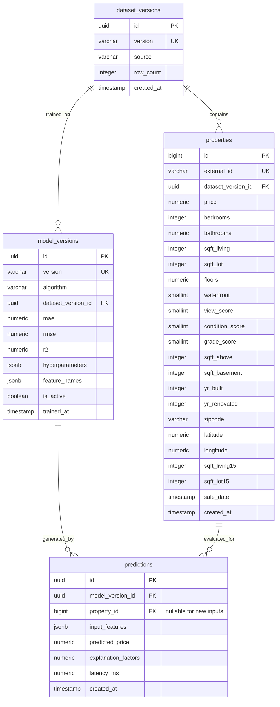

# 03. Database Specification: PostgreSQL Schema Design

## 1. Schema Overview

The database design adheres to Third Normal Form (3NF), ensuring data integrity, elimination of redundant attributes, and indexed paths for high-performance analytics and filtering.

---

## 2. Table Specifications

### 2.1 `dataset_versions`
Tracks provenance, ingestion metadata, and versioning for raw data dumps.
- `id` (UUID, Primary Key)
- `version` (VARCHAR(50), Unique, Not Null) — e.g., `kc-housing-2015-v1`
- `source` (VARCHAR(255), Not Null) — e.g., `King County Dept of Assessments / OpenML 42092`
- `row_count` (INTEGER, Not Null) — e.g., `21613`
- `description` (TEXT)
- `created_at` (TIMESTAMPTZ, Default NOW())

### 2.2 `properties`
Contains authentic property transaction records.
- `id` (BIGSERIAL, Primary Key)
- `external_id` (VARCHAR(64), Unique, Not Null) — Original transaction identifier
- `dataset_version_id` (UUID, Foreign Key &rarr; `dataset_versions.id`)
- `price` (NUMERIC(12, 2), Not Null, CHECK price > 0)
- `bedrooms` (INTEGER, Not Null, CHECK bedrooms >= 0)
- `bathrooms` (NUMERIC(4, 2), Not Null, CHECK bathrooms >= 0)
- `sqft_living` (INTEGER, Not Null, CHECK sqft_living > 0)
- `sqft_lot` (INTEGER, Not Null, CHECK sqft_lot > 0)
- `floors` (NUMERIC(3, 1), Not Null)
- `waterfront` (SMALLINT, Default 0, CHECK waterfront IN (0, 1))
- `view_score` (SMALLINT, Default 0, CHECK view_score BETWEEN 0 AND 4)
- `condition_score` (SMALLINT, Default 3, CHECK condition_score BETWEEN 1 AND 5)
- `grade_score` (SMALLINT, Default 7, CHECK grade_score BETWEEN 1 AND 13)
- `sqft_above` (INTEGER, Not Null)
- `sqft_basement` (INTEGER, Default 0)
- `yr_built` (INTEGER, Not Null, CHECK yr_built BETWEEN 1800 AND 2026)
- `yr_renovated` (INTEGER, Default 0)
- `zipcode` (VARCHAR(10), Not Null)
- `latitude` (NUMERIC(9, 6), Not Null)
- `longitude` (NUMERIC(9, 6), Not Null)
- `sqft_living15` (INTEGER)
- `sqft_lot15` (INTEGER)
- `sale_date` (DATE, Not Null)
- `created_at` (TIMESTAMPTZ, Default NOW())

### 2.3 `model_versions`
Tracks all serialized regression models, metrics, and hyperparameter logs.
- `id` (UUID, Primary Key)
- `version` (VARCHAR(50), Unique, Not Null) — e.g., `v1.0.0-rf`
- `algorithm` (VARCHAR(100), Not Null) — e.g., `RandomForestRegressor`
- `dataset_version_id` (UUID, Foreign Key &rarr; `dataset_versions.id`)
- `mae` (NUMERIC(12, 2), Not Null)
- `rmse` (NUMERIC(12, 2), Not Null)
- `r2` (NUMERIC(6, 4), Not Null)
- `hyperparameters` (JSONB, Not Null)
- `feature_names` (JSONB, Not Null)
- `artifact_path` (VARCHAR(255), Not Null)
- `is_active` (BOOLEAN, Default FALSE)
- `trained_at` (TIMESTAMPTZ, Default NOW())

### 2.4 `predictions`
Persisted audit trail of all interactive and automated valuations.
- `id` (UUID, Primary Key)
- `model_version_id` (UUID, Foreign Key &rarr; `model_versions.id`, Not Null)
- `property_id` (BIGINT, Foreign Key &rarr; `properties.id`, Nullable)
- `input_features` (JSONB, Not Null)
- `predicted_price` (NUMERIC(12, 2), Not Null)
- `explanation_factors` (JSONB)
- `latency_ms` (NUMERIC(8, 2), Not Null)
- `created_at` (TIMESTAMPTZ, Default NOW())

---

## 3. Indexing Strategy

To guarantee snappy API responses across millions of analytical aggregations:
1. `idx_properties_zipcode`: B-Tree on `properties(zipcode)` for spatial filtering.
2. `idx_properties_price`: B-Tree on `properties(price)` for range filtering and histogram generation.
3. `idx_properties_sqft_living`: B-Tree on `properties(sqft_living)` for price/sqft queries.
4. `idx_properties_bedrooms_bathrooms`: Compound index on `properties(bedrooms, bathrooms)`.
5. `idx_predictions_model_version`: B-Tree on `predictions(model_version_id)`.
6. `idx_predictions_created_at`: B-Tree on `predictions(created_at DESC)` for recent history pagination.
