# 05. Machine Learning Specification & Modeling Strategy

## 1. Problem Formulation
- **Task**: Supervised Multivariate Regression
- **Target Variable ($y$)**: `price` (USD)
- **Objective**: Accurately predict market valuation while maximizing explainability and minimizing error variance.

---

## 2. Evaluation Framework & Metrics

In strict accordance with the Anti-Vibe-Coding rule, regression performance is quantified using statistically valid metrics (no vague percentage accuracy):

1. **Mean Absolute Error (MAE)**:
   $$\text{MAE} = \frac{1}{n} \sum_{i=1}^{n} |y_i - \hat{y}_i|$$
   Directly interpretable average dollar error.

2. **Root Mean Squared Error (RMSE)**:
   $$\text{RMSE} = \sqrt{\frac{1}{n} \sum_{i=1}^{n} (y_i - \hat{y}_i)^2}$$
   Penalizes large outlier estimation mistakes.

3. **Coefficient of Determination ($R^2$)**:
   $$R^2 = 1 - \frac{\sum (y_i - \hat{y}_i)^2}{\sum (y_i - \bar{y})^2}$$
   Quantifies the proportion of target variance explained by model features.

---

## 3. Data Split & Validation Strategy

- **Split Ratio**: 80% Training ($n \approx 17,290$), 20% Holdout Test ($n \approx 4,323$).
- **Random Seed**: Fixed deterministic seed `RANDOM_STATE = 42`.
- **Cross-Validation**: 5-Fold K-Fold Cross-Validation on the training split to verify stability and guard against overfitting.
- **Strict Leakage Guard**: Preprocessing transformers (imputers, scalers, target/one-hot encoders) are fitted strictly on the $k-1$ training folds or 80% training set.

---

## 4. Candidate Algorithms

1. **Baseline Model**:
   - `LinearRegression` / `Ridge`: Provides the linear benchmark to measure non-linear lift.
2. **Random Forest Regressor**:
   - `RandomForestRegressor(n_estimators=100, max_depth=16, min_samples_split=5)`
   - Excellent handling of tabular feature interactions and non-linearities without scaling sensitivity.
3. **Gradient Boosting Regressor**:
   - `GradientBoostingRegressor(n_estimators=150, learning_rate=0.08, max_depth=6)`
   - Sequential error reduction for competitive precision.
4. **Histogram-based Gradient Boosting**:
   - `HistGradientBoostingRegressor(max_iter=150, learning_rate=0.08, max_leaf_nodes=31)`
   - Ultra-fast tree building algorithm, ideal for responsive retraining and low memory footprint.

---

## 5. Feature Engineering Pipeline

```mermaid
flowchart LR
    subgraph RawFeatures [Raw Input]
        F1[sqft_living, sqft_lot, sqft_above]
        F2[yr_built, yr_renovated]
        F3[bedrooms, bathrooms]
        F4[zipcode, lat, long]
        F5[grade, condition, view]
    end

    subgraph EngineeredFeatures [Feature Engineering]
        E1[effective_age = 2015 - max yr_built, yr_renovated]
        E2[living_to_lot_ratio = sqft_living / sqft_lot]
        E3[bed_bath_ratio = bedrooms / max bathrooms, 1]
        E4[zipcode_target_enc = Mean price per zipcode]
        E5[total_sqft = sqft_living + sqft_basement]
    end

    subgraph Estimator [Selected Best Estimator]
        M[Ensemble Tree Model]
    end

    RawFeatures --> EngineeredFeatures --> Estimator
```



---

## 6. Model Serialization & Registry Contract

Every model artifact serialized to `ml/models/<version>/` consists of:
1. `model.joblib`: Complete Scikit-learn Pipeline (Preprocessing + Estimator).
2. `metadata.json`:
   ```json
   {
     "model_name": "KingCounty_HistGradientBoosting",
     "version": "v1.0.0",
     "algorithm": "HistGradientBoostingRegressor",
     "dataset_version": "kc-housing-2015-v1",
     "training_timestamp": "2026-09-23T12:00:00Z",
     "random_state": 42,
     "metrics": {
       "test_mae": 68420.50,
       "test_rmse": 118940.12,
       "test_r2": 0.8842
     },
     "features": [
       "bedrooms", "bathrooms", "sqft_living", "sqft_lot", "floors",
       "waterfront", "view", "condition", "grade", "sqft_above",
       "sqft_basement", "yr_built", "yr_renovated", "zipcode", "lat", "long"
     ]
   }
   ```
